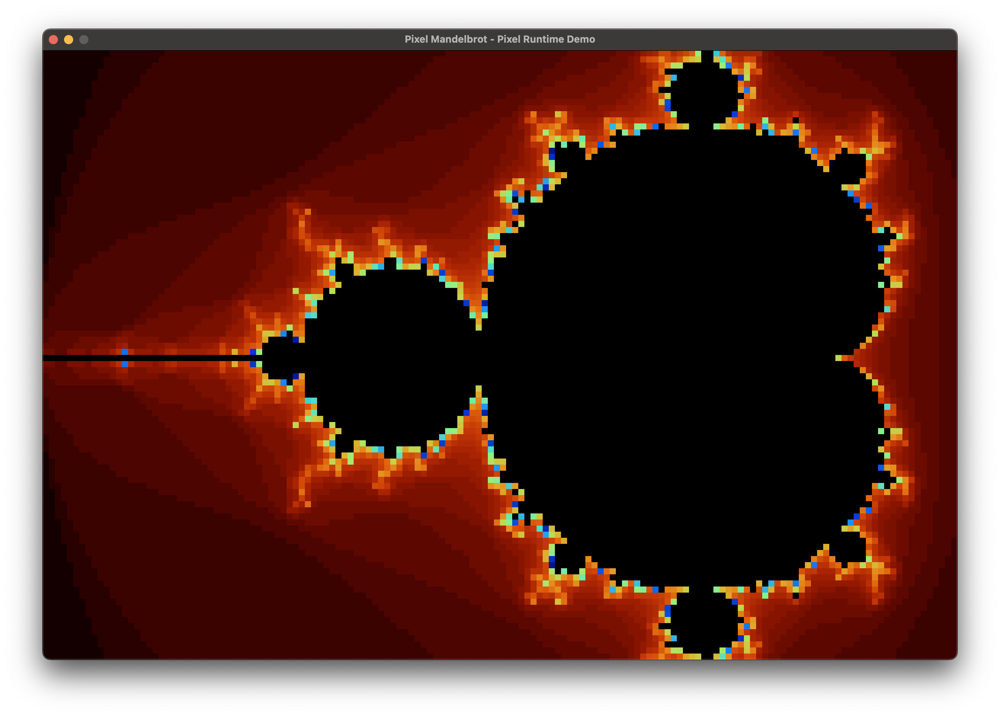

# Pixel Runtime

**Pixel Runtime** is a lightweight, modern C++20 library for direct pixel manipulation.

It provides a beginner-friendly, minimalistic API that enables developers to build expressive, pixel-based applications
without dealing with low-level graphics boilerplate.

> Important!
>
> This project is part of a book that’s currently in development. Because of that, I'm not accepting contributions yet.
> I’ll be sharing updates about the book here as things progress.
>
> Thanks so much for your interest and support! 🙌



## Features

- Pixel-Level Drawing – Easily set individual pixels with a clean API.
- Modern C++20 Design – Written using modern language features for clarity, safety, and maintainability.
- Cross-Platform – Runs on Windows, macOS, and Linux.
- Pixel Scaling – Render at low resolutions and scale up for a retro or stylized look.
- Minimal API Surface – Inherit from `App`, override a few methods, and you are ready to go.

## Getting Started

### Building the Runtime & Examples

```bash
git clone https://github.com/your-username/pixel-runtime.git
cd pixel-runtime
mkdir build && cd build
cmake ..
make
```

This builds the runtime library and bundled example applications.

### Integrating into Your Project via CMake

To add Pixel Runtime as a dependency in your own CMake project:

```cmake
include(FetchContent)
FetchContent_Declare(
        pixel_runtime
        GIT_REPOSITORY https://github.com/angelotadres/pixel-runtime.git
        GIT_TAG main # or a specific version/tag
)
FetchContent_MakeAvailable(pixel_runtime)

target_link_libraries(your_app PRIVATE pixel_runtime)
```

This will automatically fetch Pixel Runtime and its dependencies into your build.

## Example

```cpp
class MyApp : public pxr::App {
public:
    void setup() override {
        setSize(320, 240);
        setPixelSize(2);
        setTitle("My First Pixel App");
    }

    void update() override {
        drawPixel(getMouseX(), getMouseY(), pxr::Color::Red);
    }
};

PXR_MAIN(MyApp)
```

## Examples Included

- [Pixel Hello](examples/pixel_hello.cpp) – Barebones app that prints FPS
- [Pixel Noise](examples/pixel_noise.cpp) – Animated pseudo-random RGB noise
- [Pixel Paint](examples/pixel_paint.cpp) – Interactive painting with color selection
- [Pixel Mandelbrot](examples/pixel_mandelbrot.cpp) – Explore a live Mandelbrot set with keyboard controls
- [Pixel Square](examples/pixel_square.cpp) – Animated, rotating square with line drawing

Each example is self-contained and shows off a core feature of the engine.

## Requirements

The following tools must be available on your system:

- C++20 compatible compiler (GCC 10+, Clang 11+, MSVC 2019+)
- [CMake](https://cmake.org/) 3.15 or later

## Dependencies

Pixel Runtime automatically downloads and configures the following dependencies using CMake:

- [GLFW](https://www.glfw.org/) – used internally for window and input handling (abstracted away from the public API)
- [GLAD](https://glad.dav1d.de/) – used internally for OpenGL function loading (not exposed to the user)
- [GLM](https://github.com/g-truc/glm) – header-only math library for vectors and matrices (included with Pixel Runtime
  and available to users without separate installation)

No manual installation is required, CMake will handle everything during the build process.

## License

Pixel Runtime is licensed under the MIT License. See [LICENSE](LICENSE) for details.
